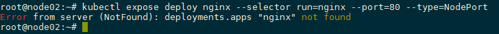
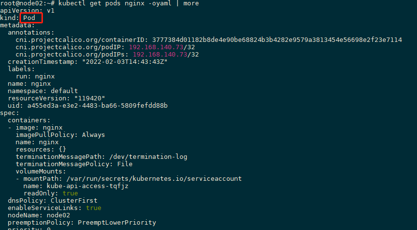
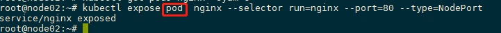
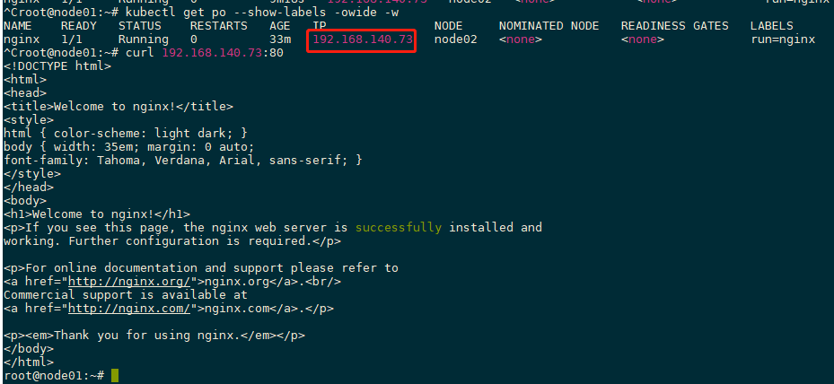
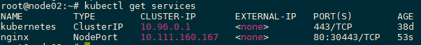

## Simple pod demo

### Run nginx as webserver

```shell
$ kubectl run --image=nginx nginx
$ kubectl run --image=nginx nginx --restart='Always'
```

### Show running pod

```shell  
$ kubectl get pod --show-labels -owide -w
```

### Expose service

```shell
$ kubectl expose deploy nginx --selector run=nginx --port=80 --type=NodePort
```
    - defraud:
> 

    - analysis:
> 
> 
> 
> 
> 

### Check service detail

```shell
$ kubectl get services
```
> 

### Access service

```shell
$ curl 192.168.140.73:80
```