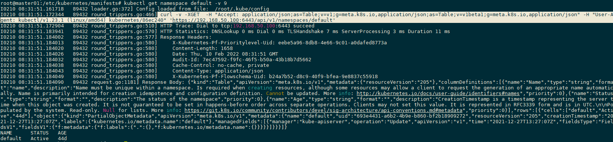

## Static token

### Put static-token to target folder

```sh
mkdir -p /etc/kubernetes/auth
cp static-token /etc/kubernetes/auth
```

### Backup your orginal apiserver

```sh
cp /etc/kubernetes/manifests/kube-apiserver.yaml ~/kube-apiserver.yaml
```

### Override your kube-apiserver with the one with static-token config

```sh
cp ./kube-apiserver.yaml /etc/kubernetes/manifests/kube-apiserver.yaml
```

### Get kubernetes object with static token
#### 在 master 执行 kubectl get namespace default -v 9 查找下面的 curl 语句
> 

```sh
curl -v -XGET  -H "Authorization: Bearer cncamp-token" 'https://192.168.50.100:6443/api/v1/namespaces/default' -k
```