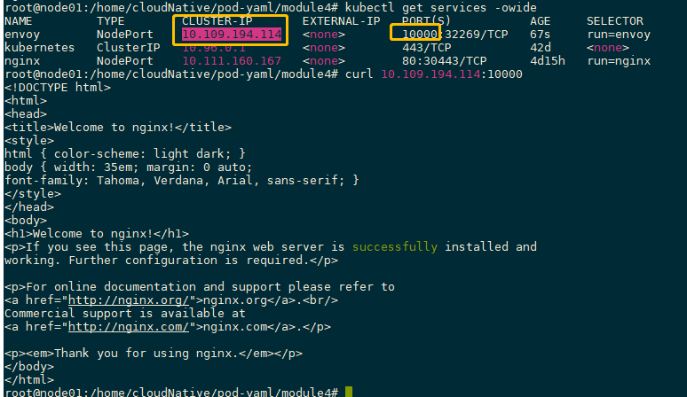

## Run envoy

```shell
$ kubectl create configmap envoy-config --from-file=envoy.yaml
$ kubectl create -f envoy-deploy.yaml
$ kubectl expose deploy envoy --selector run=envoy --port=10000 --type=NodePort
```

## Access service

```shell
$ curl <NODE IP Address>:<NodePort>
```

Notices: Node IP Address base on your kubernetes cluster.

Example:

```shell
$ curl 10.109.194.114:10000
```
> 

## Scale up/down/failover

```shell
$ kubectl scale deploy <deployment-name> --replicas=<n>
```